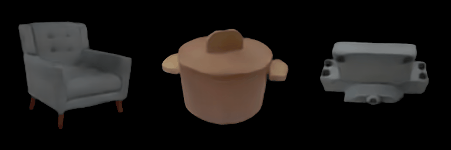

# FORGE: Few-View Object Reconstruction with Unknown Categories and Camera Poses

### [Project Page](https://ut-austin-rpl.github.io/FORGE/) |  [Paper](https://arxiv.org/abs/2212.04492.pdf)
<br/>

> Few-View Object Reconstruction with Unknown Categories and Camera Poses  
> [Hanwen Jiang](https://hwjiang1510.github.io/), [Zhenyu Jiang](https://zhenyujiang.me/), [Kristen Grauman](https://www.cs.utexas.edu/users/grauman/), [Yuke Zhu](https://cs.utexas.edu/~yukez)


## Installation

```
conda create --name forge python=3.8
conda activate forge

# Install pytorch or use your own torch version
conda install pytorch==1.10.0 torchvision==0.11.0 torchaudio==0.10.0 cudatoolkit=11.3 -c pytorch -c conda-forge

# Install pytorch3d, please follow https://github.com/facebookresearch/pytorch3d/blob/main/INSTALL.md
# We use pytorch3d-0.7.0-py38_cu113_pyt1100

pip install -r requirements.txt
```

To enable depth rendering using PyToch3D, add the following code segment to `PYTORCH3D_PATH/renderer/implicit/raymarching.py` Line 108.

```
if 'render_depth' in kwargs.keys() and kwargs['render_depth'] == True and 'ray_bundle' in kwargs.keys():
    ray_bundle_lengths = kwargs['ray_bundle'].lengths[..., None]
    depths = (weights[..., None] * ray_bundle_lengths).sum(dim=-2)
    return torch.cat((features, opacities, depths), dim=-1)
```

You can check your PyTorch3D path by the following:
```
import pytorch3d
print(pytorch3d.__file__)
```

## Run FORGE demo
- Download pretrained weights for both step 1.1 and 3.3 (included below).
- Put them in `./output/kubric/gt_pose/gt_pose/` and `./output/kubric/joint_pose_2d3d/pred_pose_2d3d_joint_train/`, respectively.
- Run demo on real images with `python demo.py --cfg ./config/demo/demo.yaml`.
- An example of expected result is shown below.


## Train FORGE

### Download Dataset

- You can access our datasets ([link](https://utexas.box.com/s/iflij0dj5208zd1dhsbgykc6fwt2evst)). We also provide link which you can directly download using `wget`.

| Dataset | Wget Link |
| ------------- |------------- |
| ShapeNet | [Link](https://utexas.box.com/v/forge-dataset-shapenet) |
| GSO | [Link](https://utexas.box.com/v/forge-dataset-gso) |

- Modify `self.root` in ./`dataset/kubric.py` and `./dataset/gso.py` to use.

### Train FORGE
| Step  | Trained Params | Command | ETA | Note |
| ------------- | ------------- | ------------- | ------------- |------------- |
| 1.1 | Model without pose estimator | `./run/kubric_train_pose_3D_gt_pose.sh` | 1 day| - | 
| 1.2 | 3D-based pose estimator | `./run/kubric_train_pose_3D_pred_pose.sh` | 0.5 day | Dependent on Step 1.1 | 
| 2 | 2D-based pose estimator | `./run/kubric_train_pose_2D.sh` | 6 hour | Not dependent on Step 1 | 
| 3.1 | Pose estimator head | `./run/kubric_train_pose_2D3D_head.sh` | 2 hour | A quick warmup | - |
| 3.2 | Full pose estimator | `./run/kubric_train_pose_2D3D.sh` | 0.5 day | Dependent on Step 3.1 | 
| 3.3 | Full model | `./run/kubric_train_pose_2D3D_finetune.sh` | 1 Day | Dependent on Step 3.2 | 

The default training configurations require about 300GB at most, e.g. 8 A40 GPUs with 40GB VRAM, each.

### Model Weights
We provide the pre-train weight for each step and their saving path.
| Step  | Svaing path | Link |
| ------------- | ------------- | ------------- |
| 1.1 | `./output/kubric/gt_pose/gt_pose` | [Link](https://utexas.box.com/v/forge-weight-gt-pose) |
| 1.2 | `./output/kubric/pred_pose_3d/pred_pose_3d` | [Link](https://utexas.box.com/v/forge-weight-pred-pose-3d) |
| 2 | `./output/kubric/pred_pose_2d/pred_pose_2d` | [Link](https://utexas.box.com/v/forge-weight-pred-pose-2d) |
| 3.1 | `./output/kubric/pretrain_pose_2d3d/pred_pose_2d3d_pretrain` | - |
| 3.2 | `./output/kubric/pred_pose_2d3d/pred_pose_2d3d` | [Link](https://utexas.box.com/v/forge-weight-pred-pose-2d3d) |
| 3.3 | `./output/kubric/joint_pose_2d3d/pred_pose_2d3d_joint` |[Link](https://utexas.box.com/v/forge-weight-joint-pose-2d3d) |


## Evaluate
- We evaluate results with and without test-time pose optimization.
    - For ShapeNet seen categories, use `./run/kubric_eval_seen.sh`.
    - For ShapeNet unseen categories, use `./run/kubric_eval_unseen.sh`.
    - For GSO unseen categories, use `./run/gso_eval.sh`.

- The visualization and evaluation logs are saved in the corresponding path specified by the configs. Use `./scripts/eval_readout.py` to read out results.

- You can try to use camera synchronization by adding argument `--use_sync` (default unused, it collapses under large pose errors but can slightly improve pose results on most samples).

- We provide raw evaluation results for enabling detailed analysis on each category ([link](https://utexas.box.com/s/0x3wx38fpuylbomcl31rs7pc91wnisnz)).

## Known Issues
- The model trained on synthetic data in the dark environment doesn't generalize well in some real-image with strong lights.
- The fusion module degenerates after fine-tuning. We use the weight before fine-tuning.

## Citation
```bibtex
@article{jiang2024forge,
   title={Few-View Object Reconstruction with Unknown Categories and Camera Poses},
   author={Jiang, Hanwen and Jiang, Zhenyu and Grauman, Kristen and Zhu, Yuke},
   journal={International Conference on 3D Vision (3DV)},
   year={2024}
}
```


